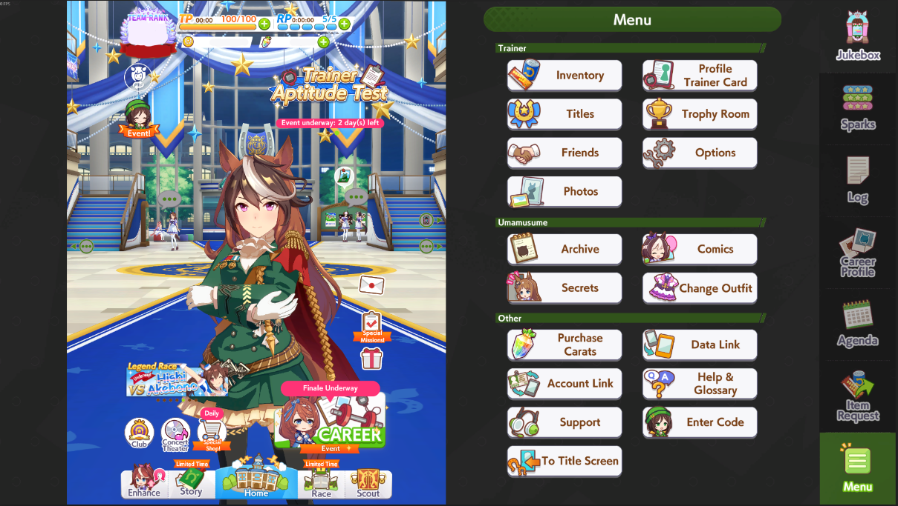
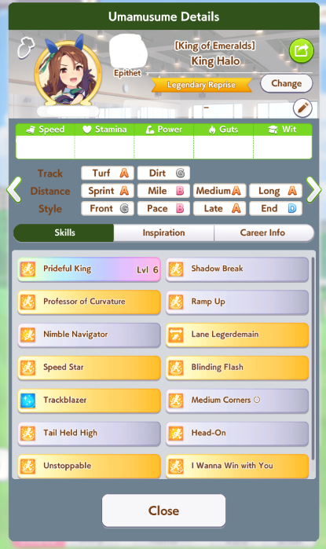
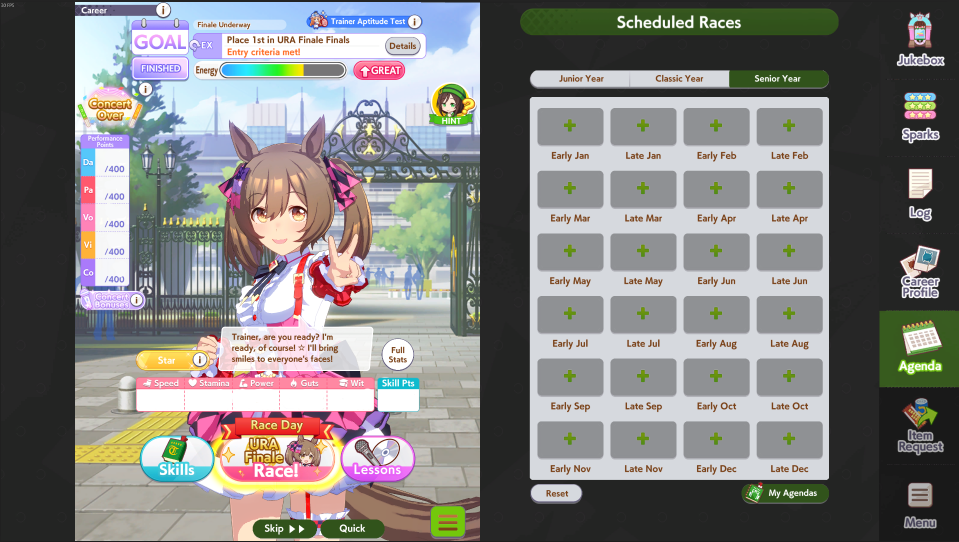
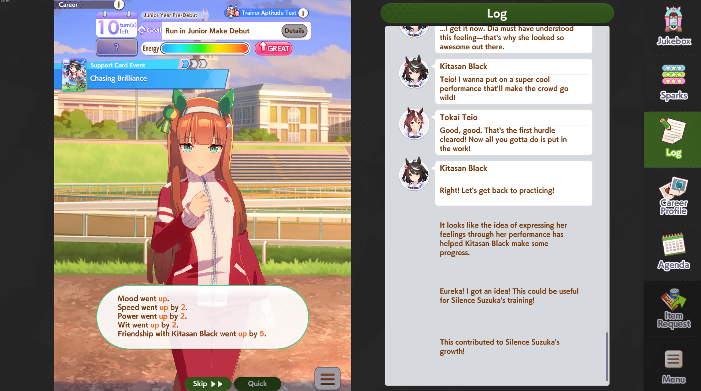

# Umamusume Dark Mode UI 🌙

A custom dark mode UI for **Umamusume: Pretty Derby**.

This project replaces the game's original UI texture with a darker version designed to be more comfortable to use at night, while keeping the original Umamusume visual style.

## Preview

### Main Menu



### Umamusume Details



### Career & Agenda



### Career & Log



## Download

**[Download Umamusume Dark Mode UI v1.0](../../releases/latest)**

## Installation

### 1. Download all game data

Before installing the UI, open Umamusume and go to:

**Menu → Options → Download All**

Wait until the game finishes downloading all available game data.

### 2. Back up `resources.assets`

Open your Umamusume installation folder and go to:

```text
UmamusumePrettyDerby_Data
```

Find:

```text
resources.assets
```

**Make a backup copy of this file before continuing.**

### 3. Download UABEA

Download **UABEA** from its GitHub repository:

[UABEA](https://github.com/nesrak1/UABEA)

Extract it somewhere convenient and launch UABEA.

### 4. Open `resources.assets`

In UABEA, open:

```text
UmamusumePrettyDerby_Data/resources.assets
```

### 5. Find `PreIn_tex`

Open **Filters** and select:

**Texture2D**

Then search for:

```text
PreIn_tex
```

Select `PreIn_tex`.

### 6. Import the Dark Mode texture

With `PreIn_tex` selected, go to:

**Plugins → Edit Texture2D → Load Texture...**

Download the latest Dark Mode UI file from the Releases page.

Click **Save** in the texture editor.

### 7. Save the modified asset

In UABEA, select:

**File → Save Selected**

or press:

**Ctrl + S**

That's it!

Launch Umamusume and the Dark Mode UI should now be applied.

## Important

Always keep a backup of your original `resources.assets`.

If you want to return to the original UI, restore your backup.

This project only replaces the `PreIn_tex` texture. You do **not** need to replace your entire `resources.assets` with someone else's file.

## Known limitations

Some UI elements share the same texture, and some text colors are hardcoded in the game.

Because of this, certain UI panels cannot be made as dark as others without reducing text readability.

The texture has been darkened as much as possible while keeping the UI readable.

## Credits

Dark Mode UI created by [UmaNoYoru](https://github.com/UmaNoYoru).

UABEA created by [nesrak1](https://github.com/nesrak1).
